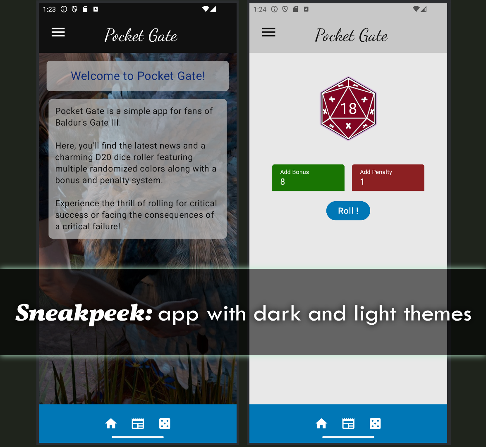

## 2024-Q3-Mobiiliohjelmointi

Tämä repositorio sisältää tekemiäni viikkotehtäviä mobiiliohjelmoinnin kurssilla Mobiiliohjelmointi natiiviteknologioilla IN00CT07-3007

## Viikkotehtävien sijainnit

**repon ulkopuolella**
- Viikko 1: Kuvankaappaus Moodlessa

**mobiili-first**
- Viikko 2: BMI -muunnin
- Viikko 3: Kirjautumislomake ilman toiminnallisuutta
- Viikko 4: Teemat (ja nappi)
- Viikko 5: Kalorit -laskuri
- Viikko 6: Scaffold -navigaatio, integroitu sovellukseen
- Viikko 7: Tulossa
- Viikko 8: Tulossa
  - *Sovellusosat löytyvät hampparivalikosta sekä projektin screens -kansiosta omina komponentteinaan*
  - *Teemat ja navigaatio integroitu sovellukseen*

**mobiili-second**
- 4-5:een tähtäävä kurssityö: Pocket Gate -sovellus

